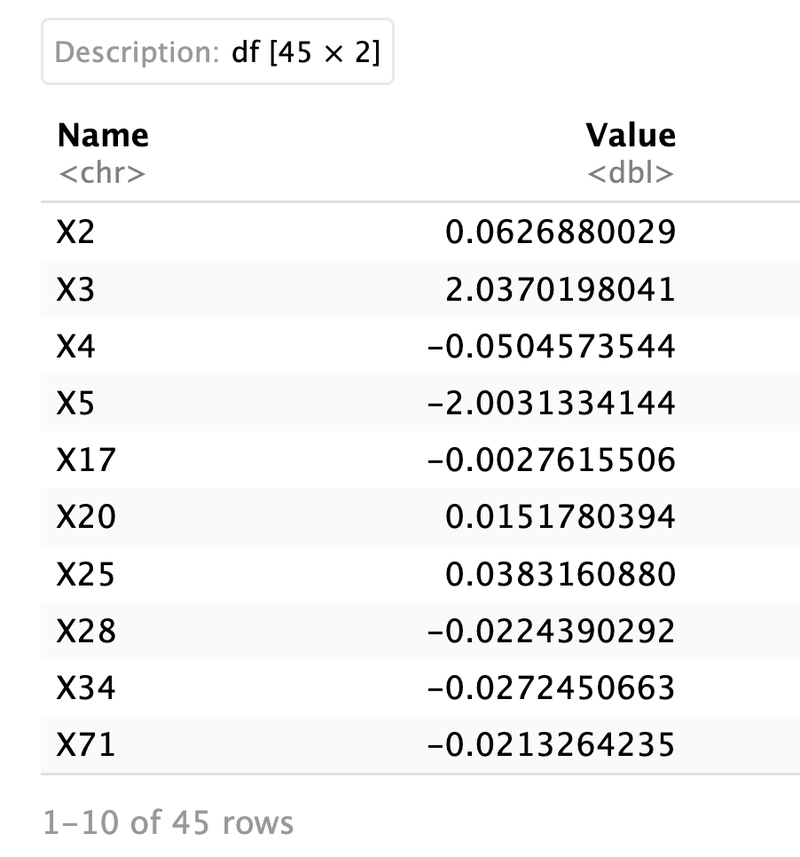

# Robust-variable-selection-with-Cox-model

This repository provides codes for comparing robust and non-robust variable selection methods with the Cox model for high-dim bioinformatic and biomedical data. We provide an easy-to-follow R file 'run_comparison.Rmd' to illustrate how users can easily use our function to compare these methods on a simulated dataset and a real dataset.   
We provide the dependent packages 'ncvreg2' as a .zip file and the source files: 'pawph.R', 'pawph_mcp.R' and 'pawph_scad.R'. 

This repository corresponds to our manuscript xxx. We also include all high-resolution figures under the 'Figure' folder. 

A quick start is as follows:

## Install the "ncvreg2" package
```
install.packages('ncvreg2_3.13.0.tar.gz', repos=NULL, type='source')
```
## Load required packages
```
library(Matrix)
library(dplyr)
library(survival)
library(glmnet)
library(ncvreg)
library(ggplot2)
library(caret)
library(Hmisc)
library(SIS)
library(MASS)
library(ncvreg2)
library(faux)
library(ggpubr)
library(hdnom)
library(purrr)
library(reshape2)
library(data.table)
```

## The benchamrk function
```
result_cal=function(current_data2,model_name){
  X=as.matrix(current_data2[,!colnames(current_data2)%in%c("time","status")])
  y=Surv(current_data2$time,current_data2$status)
  time=current_data2$time
  status=current_data2$status
  if(model_name=="pawph"){
    model6 <- prcoxreg(y,X, seed=1, alpha= 0.5)
    # PAWPH estimator
    result=model6$betaHat_re
    output=result[result!=0]}
  if(model_name=="ncvreg"){
    #ncvreg
    method1<-ncvreg::cv.ncvsurv(X,y,gamma=3,penalty="MCP",alpha=1,nfolds=10)
    result=method1$fit$beta[,which(method1$fit$lambda==method1$lambda.min)]
    output=result[result!=0]
  }
  if(model_name=="SIS"){
    model2=SIS(X,y,family='cox', penalty='lasso', tune='bic', varISIS='cons',seed=41,nfolds = 10,type.measure = "deviance")
    #colnames(X)[model2$ix]
    result=model2$coef.est
    output=result[result!=0]
  }
  if(model_name=="lasso"){
    #lasso
    fitlasso1<-hdnom::fit_lasso(X, Surv(time, status), nfolds = 10, rule = "lambda.min")
    mat=fitlasso1$model$beta
    non_zero_indices <- which(mat[] != 0, arr.ind = TRUE)
    non_zero_values_lasso1 <- data.frame(
      Name = rownames(mat)[non_zero_indices[, 1]],
      Value = mat@x
    )
    output=non_zero_values_lasso1
  }
  if(model_name=="enet"){
    #enet
    fitenet1<-hdnom::fit_enet(X, Surv(time, status), nfolds = 10, rule = "lambda.min")
    mat=fitenet1$model$beta
    non_zero_indices <- which(mat[] != 0, arr.ind = TRUE)
    non_zero_values_enet1 <- data.frame(
      Name = rownames(mat)[non_zero_indices[, 1]],
      Value = mat@x
    )
    output=non_zero_values_enet1
  }
  if(model_name=="alasso"){
    #alasso
    fitlasso1<-hdnom::fit_alasso(X, Surv(time, status), nfolds = 10, rule = "lambda.min")
    mat=fitlasso1$model$beta
    non_zero_indices <- which(mat[] != 0, arr.ind = TRUE)
    non_zero_values_lasso1 <- data.frame(
      Name = rownames(mat)[non_zero_indices[, 1]],
      Value = mat@x
    )
    output=non_zero_values_lasso1
  }
  if(model_name=="aenet"){
    #aenet
    fitenet1<-hdnom::fit_aenet(X, Surv(time, status), nfolds = 10, rule = "lambda.min")
    mat=fitenet1$model$beta
    non_zero_indices <- which(mat[] != 0, arr.ind = TRUE)
    non_zero_values_enet1 <- data.frame(
      Name = rownames(mat)[non_zero_indices[, 1]],
      Value = mat@x
    )
    output=non_zero_values_enet1
  }
  if(model_name=="scad"){
    #alasso
    fitlasso1<-hdnom::fit_scad(X, Surv(time, status), nfolds = 10)
    mat=fitlasso1$model$beta
    non_zero_indices <- which(mat[] != 0, arr.ind = TRUE)
    non_zero_values_lasso1 <- data.frame(
      Name = rownames(mat)[non_zero_indices[, 1]],
      Value = mat[non_zero_indices[, 1],1]
    )
    output=non_zero_values_lasso1
  }
  if(model_name=="mnet"){
    #aenet
    fitenet1<-hdnom::fit_mnet(X, Surv(time, status), nfolds = 10)
    mat=fitenet1$model$beta
    non_zero_indices <- which(mat[] != 0, arr.ind = TRUE)
    non_zero_values_lasso1 <- data.frame(
      Name = rownames(mat)[non_zero_indices[, 1]],
      Value = mat[non_zero_indices[, 1],1]
    )
    output=non_zero_values_lasso1
  }
  if(model_name=="snet"){
    #aenet
    fitenet1<-hdnom::fit_snet(X, Surv(time, status), nfolds = 10)
    mat=fitenet1$model$beta
    non_zero_indices <- which(mat[] != 0, arr.ind = TRUE)
    non_zero_values_lasso1 <- data.frame(
      Name = rownames(mat)[non_zero_indices[, 1]],
      Value = mat[non_zero_indices[, 1],1]
    )
    output=non_zero_values_lasso1
  }
  return(list(output,table(current_data2$status)))
}
```

## A simulated dataset example

### The function for survival data simulation
```
sim_data_fun=function(seed,n,p,beta,outlier,h0,k.shape,outlier_percentage){
  set.seed(seed)
  corr_matrix <- matrix(0.1, nrow = p, ncol = p)
  diag(corr_matrix) <- 1
  #first 3 are highly correlated
  corr_matrix[1, 2] <- 0.9
  corr_matrix[1, 3] <- 0.9
  corr_matrix[2, 1] <- 0.9
  corr_matrix[3, 1] <- 0.9
  corr_matrix[2, 3] <- 0.9
  corr_matrix[3, 2] <- 0.9
  #4,5,6 are highly correlated
  corr_matrix[4, 5] <- 0.7
  corr_matrix[4, 6] <- 0.7
  corr_matrix[5, 4] <- 0.7
  corr_matrix[5, 6] <- 0.7
  corr_matrix[6, 4] <- 0.7
  corr_matrix[6, 5] <- 0.7
  #4 is not correlated with 1,2,3
  corr_matrix[1, 4] <- 0
  corr_matrix[2, 4] <- 0
  corr_matrix[3, 4] <- 0
  corr_matrix[4, 1] <- 0
  corr_matrix[4, 2] <- 0
  corr_matrix[4, 3] <- 0
  
  X <- mvrnorm(n, mu=rep(0,p),Sigma = corr_matrix)
  colnames(X)=paste0("X", 1:p, "")
  r.u <- runif(n)
  if(outlier==TRUE){
    num.out <- n*outlier_percentage#5%outliers
    gamma <- c(rep(0, n-num.out),  rep(5,ceiling(num.out)))
    ftime <- (-log(r.u)/((h0^k.shape)*exp(X %*% beta))+gamma)^(1/k.shape)
    ctime=runif(n,min=0,max=10)
    time <- pmin(ftime, ctime)
    status <- as.numeric(ftime <= ctime)
    current_data2=cbind.data.frame(time,status,X)
  } else{
    
    ftime <- (-log(r.u)/((h0^k.shape)*exp(X %*% beta)))^(1/k.shape)
    ctime=runif(n,min=0,max=10)
    time <- pmin(ftime, ctime)
    status <- as.numeric(ftime <= ctime)
    current_data2=cbind.data.frame(time,status,X)
  }
  return(current_data2)
}

```

### Vary outlier levels
```
run_fun_outlier=function(iter,model_name,outlier,h0,k.shape,outlier_percentage){
  current_data=sim_data_fun(iter,n=300,p=1000,beta=c(0,0,3,0,-3,0,rep(0,1000-7),5),outlier,h0=0.5,k.shape=5,outlier_percentage=outlier_percentage)
  result_cal_result=result_cal(current_data,model_name)
  return(result_cal_result)
}
```

### Run examples
```
result1=run_fun_outlier(1,model_name = "lasso",outlier = FALSE)
result2=run_fun_outlier(1,model_name = "lasso",outlier = TRUE,outlier_percentage = 0.05)
```

### Results


This results show the selected variables and their estimated coefficients.

## A real data example

### Load the data from a .csv file
```
current_data=read.csv("UVM.csv")
current_data2=current_data
colnames(current_data2)[(dim(current_data2)[2]-2):dim(current_data2)[2]]=c("control_var","status","time")
current_data2$time=as.numeric(current_data2$time)
current_data2=current_data2[current_data2$time>0,]
current_data2=current_data2[!is.na(current_data2$time),]
current_data2$control_var=ifelse(current_data2$control_var=="FEMALE",0,1) #female is group0 as the proportion control
current_data2=current_data2[,-which(colnames(current_data2)=="control_var")]
current_data2=current_data2[,-1]
dim(current_data2)
```


### Ger results
```
lasso_result=result_cal(current_data2,model_name="lasso")
enet_result=result_cal(current_data2,model_name="enet")
mnet_result=result_cal(current_data2,model_name="mnet")
snet_result=result_cal(current_data2,model_name="snet")
source("pawph_mcp.R")
pawphmcp_result=result_cal(current_data2,model_name="pawph")
source("pawph_scad.R")
pawphscad_result=result_cal(current_data2,model_name="pawph")
sis_result=result_cal(current_data2,model_name="SIS")

```

### Summarise results in a heatmap


